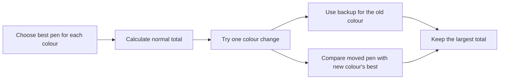

# Pretty Pens: Simple Solution Plan

## The basic idea

For every colour, remember only its two most-pretty pens:

- `best[colour]`: the pen normally chosen;
- `backup[colour]`: the pen used if `best[colour]` is moved.

Without changing a pen, the score is simply:

`sum(best[colour])`

Changing a pen can only affect the colour it leaves and the colour it enters.
That means all other colours keep their current best pen.

## Try one move

For a possible move from colour `A` to colour `B`:

1. Remove the moved pen's old contribution from colour `A`.
2. Fill colour `A` with its backup, if it has one.
3. Add the moved pen to colour `B`; it matters only if it is prettier than
  `best[B]`.
4. Compare this score with the score before the move.

The move is useful only when its improvement is positive. Trying every pen
directly would be too slow, so the implementation should keep the few largest
candidate values globally and avoid checking every colour after every query.

## Handle updates

Each query changes one pen:

- If its colour changes, refresh the old and new colours.
- If its prettiness changes, refresh its current colour.

After refreshing, output the new answer. The first answer is printed before
any queries, then one answer is printed after each query.

For fast updates, use heaps with lazy deletion. When a pen changes, add its
new version to the appropriate heap and ignore old versions when they reach
the top. Each colour's heap needs to provide its best two valid pens.

## Correctness argument

The normal score is optimal when no pen is changed because each colour chooses
its prettiest pen independently. If one pen is changed, only its old colour
and new colour can have different choices; every other colour still uses its
old best pen. Therefore checking the best possible move for each affected pair
of colours, together with the no-change option, checks every possible answer.

## Testing plan

Check:

- one colour;
- a colour with only one pen;
- equal prettiness values;
- moving a pen to its current colour;
- changing the same pen repeatedly;
- an empty colour;
- a move that makes the answer worse.

For small random cases, compare the fast solution with a brute-force version
that tries every possible moved pen and recomputes the score from scratch.

## Target complexity

Refreshing a colour takes amortized `O(log n)` time with heaps. A query changes
at most two colours, so the target is `O(log n)` amortized time per query and
`O(n + q)` memory, where `q` is the number of queries.